# KS0089 MKS BaseV1.2 3D Printer Controller Board (RAMPS 1.4 + Arduino 2560 Remix Board)

Download Resource：  [Resource](./Resource.7z)

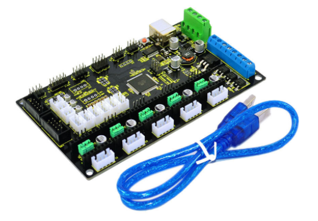

## 1. Intruduction

The new MKS Base 1.2 3D Printer Controller board combines and improves the assets of the RAMPS 1.4 and Arduino Mega 2560 boards on a fantastic single board solution. The MKS Base 1.2 is an optimal 3D printer controller solution for your Reprap 3D Printer.

## 2. Main features

- The MKS Base 1.2 solves interface connection problems between the Arduino Mega 2560 and RAMPS 1.4 boards by having both integrated into a single board
- 5 Stepper Motor Driver Slots. The boards supports a wide variety of Stepper Motor Drivers - most notably A4988, DRV8825 and Ice-Blue Stepper Motor drivers drive
- The MKS Base 1.2 board uses a high quality 4-layer PCB which optimizes heat dissipation
- Firmware can use the same configuration as RAMPS 1.4
- Easy DISPLAY + SD-CARD connector - compatible pin header on board for 12864 & 2004 LCD Display controller panels.
- 6x end stop connectors with power supply Xmin/Xmax/Ymin/Ymax/Zmin/Zmax
- 3 x 5V output, 3 x Power voltage output
- Reserve motor pulse and direction output port
- Support 12V-24V power input

## 3. List

- MKS BaseV1.2 3D Printer Controller Board
- usb cable

## 4. Connection Method

A. Mount DRV8825 correctly, don’t mount reversely, or they will be burnt, as shown below:

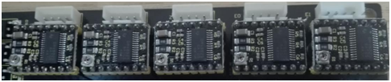

B. As for 2004LCD, connect ESP1 to ESP1, ESP2 to ESP2, as shown below:

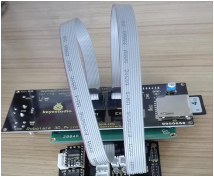

C. Diagram connection as shown below:

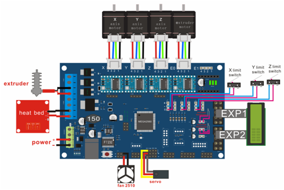

## 5. Connection Method

**1.Install Diver Software**

A. Connect the main board with computer, and then right click “Computer” to enter “Device Manage”.

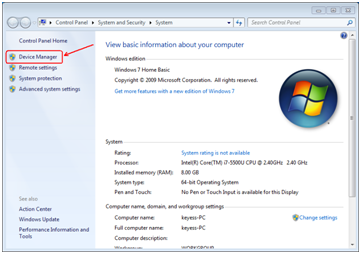

B. Double click “Other devices”, appearing “USB Serial Port”.

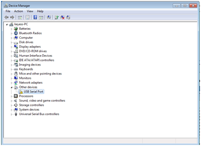

Then, right click “USB Serial Port” and select “Update Driver Software” to install driver software.

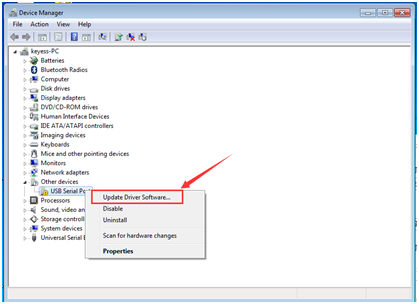

After that, select “Browse my computer for driver software” to find the file.

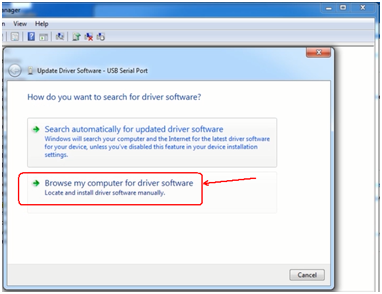

Browse to search for driver software.

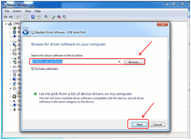

After your driver software updated, click “Close” to finish.

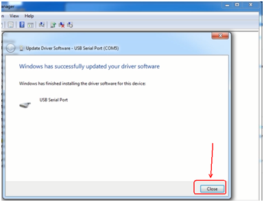

C. Finally, installation is done, and double click “Ports”in “Device Manager”, you can see “USB Serial Port”.

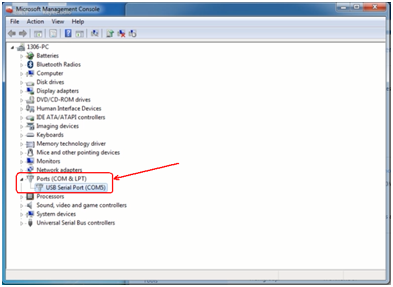

**2.Software Download**

Open the browser and search:  https://www.arduino.cc/en/software, we will take WINDOWS system as an example to show you how to download and install.

You just need to click JUSTDOWNLOAD,then click the downloaded file to install it.And when the ZIP file is downloaded,you can directly unzip and start it.

**3.Set Arduino IDE** 

Connecting the board to the computer，and select the development board and port.

After upload the firmware the LCD will display some parameter as shown below:

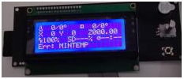

**4.Install Slicer Software Repetier-Host**

First, run this application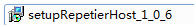.

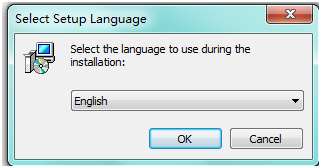

Click “Next” to continue.

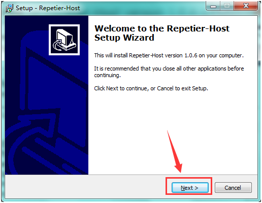

Check “I accept the agreement”, and click “Next” to continue.

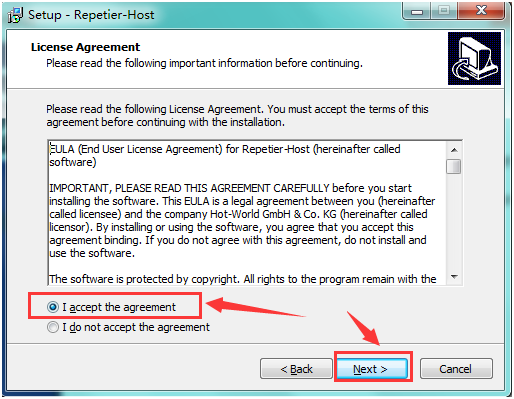

Select destination location, and click “Next” to continue.

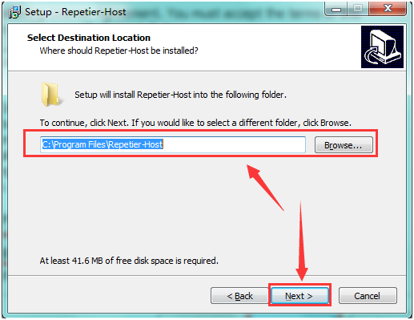

Check components that should be installed, and click “Next” to continue.

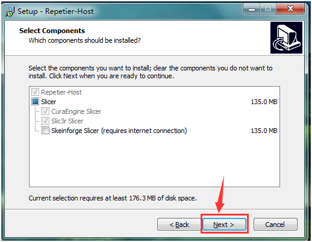

Select star menu folder, and click “Next” to continue.

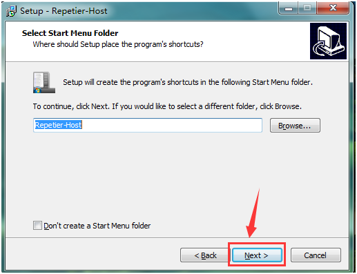

Click “Next” to continue.

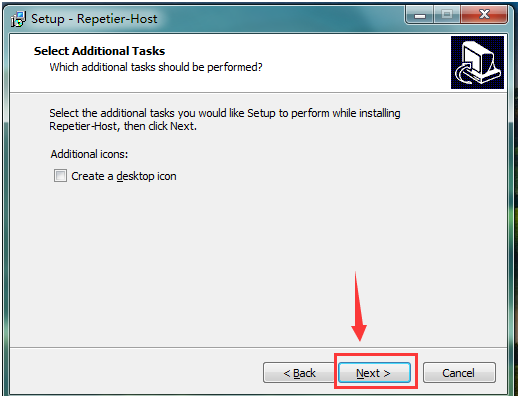

Click “Install” to install.

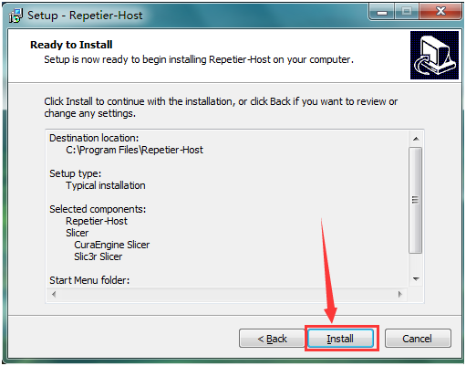

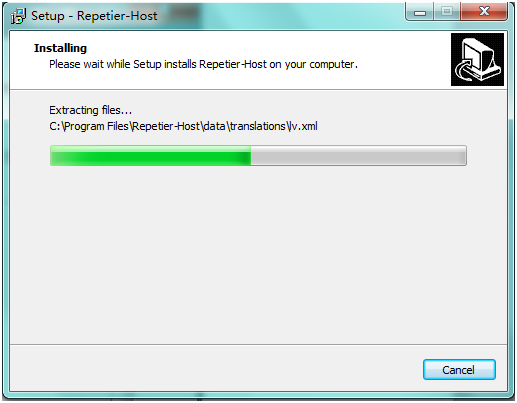

Click “Finish” to exit Setup.

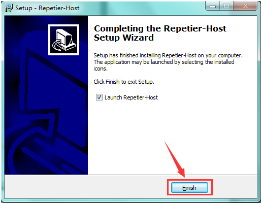

## 6. Application of Slicer Software

A. Run Repiter-Host,click Load to open a printing model.

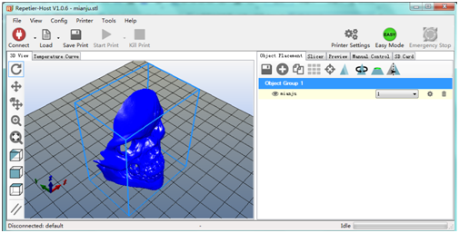

B. Click Printer Settings to complete some setup, referring to below figure.

C. Enter Object Placement to set placing position, printing size and so on.

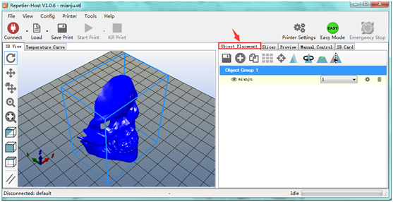

D. Click Slicer to set slicer, like printing speed. After setting slicer, click Start Slicing to begin slicing.

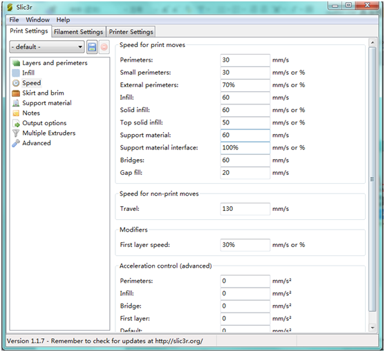

E. After slicing, go to Preview→G-Code Editor, copy G-Code to SD card, and then insert the card into the main board. It is time to kick off the print! Though the LCD screen go to : Print from SD→Desired File. Or you can connect your 3D printer to computer using a USB cable to start the print.

F. Click “Connect”and then click “Start Print” to begin the print. After some time, your printer gets ready and the buzzer rings, then you should press the button on LCD to start.

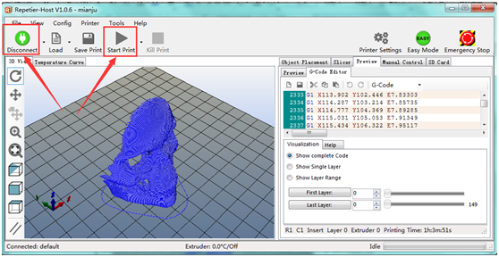

G. We just introduce a simple method about printing. Thanks to selling only main board by us, you should design your own structure and outlook of your 3D printer, and you should also set your own configuration to meet your need. After you assembling your printer, the printer need to be leveled, so you can make some setup in Preview and Manual Control, and surf the internet for further information.

H. We have a G-Code to test the main board. Power it on, open limit switch and stepper motor, drive three motors; put a Fnbduino.gco file to Preview, click Start Print, if the motors rotate, X/Y/Z value in Manual Control changes, the main board works as shown below:

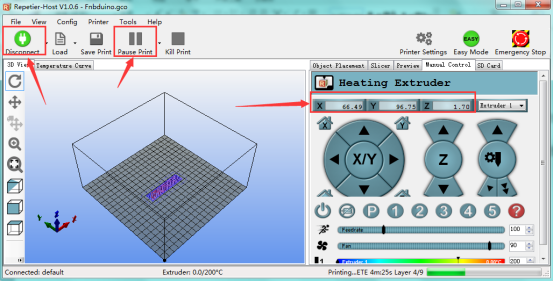